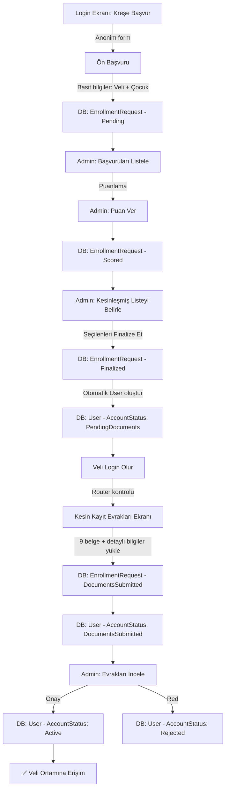

# Kreş Kayıt İş Akışı — Uygulama Planı

## Akış Diyagramı



---

## Veri Modeli

### EnrollmentStatus Enum (6 durum)
| Değer | Durum | Açıklama |
|-------|-------|----------|
| 0 | Pending | Ön başvuru yapıldı |
| 1 | Scored | Admin puanladı |
| 2 | Finalized | Kesinleşmiş listede — User hesabı oluşturuldu |
| 3 | DocumentsSubmitted | Kesin kayıt evrakları yüklendi |
| 4 | Approved | Admin onayladı — tam erişim |
| 5 | Rejected | Reddedildi |

### AccountStatus Enum (User tablosu)
| Değer | Durum | Açıklama |
|-------|-------|----------|
| 0 | PendingDocuments | Kesinleşmiş listede, evrak bekliyor |
| 1 | DocumentsSubmitted | Evraklar yüklendi, admin onayı bekliyor |
| 2 | Active | Tam erişim |
| 3 | Suspended | Askıya alındı |

### EnrollmentRequest — Yeni Alanlar
- `Score` (int?) — Admin puanı
- `ScoringNotes` (string?) — Puanlama notları
- `CreatedUserId` (Guid?) — Finalize sırasında oluşturulan User.Id

---

## API Endpoint'leri

| Endpoint | Yetki | Açıklama |
|----------|-------|----------|
| `POST /api/enrollment` | Anonim | Ön başvuru (basit form) |
| `GET /api/enrollment` | Admin | Tüm başvurular |
| `GET /api/enrollment/pending` | Admin | Puanlanmayı bekleyenler |
| `GET /api/enrollment/finalized` | Admin | Kesinleşmiş liste |
| `PUT /api/enrollment/{id}/score` | Admin | Puanlama |
| `PUT /api/enrollment/{id}/finalize` | Admin | Kesinleştir + User oluştur |
| `PUT /api/enrollment/{id}/approve-docs` | Admin | Evrak onayı → tam erişim |
| `PUT /api/enrollment/{id}/reject` | Admin | Reddet |
| `GET /api/final-registration` | Auth (Veli) | Mevcut başvuru bilgilerini getir |
| `PUT /api/final-registration/details` | Auth (Veli) | Sağlık/acil bilgi güncelle |
| `POST /api/final-registration/documents/{field}` | Auth (Veli) | Evrak yükle (MinIO) |
| `PUT /api/final-registration/submit` | Auth (Veli) | Evrakları tamamla |

---

## Flutter Ekranları

| Ekran | Dosya | Koşul |
|-------|-------|-------|
| Ön Başvuru | `enrollment_request_screen.dart` | Login → "Kreşe Başvur" (anonim) |
| Kesin Kayıt Evrakları | `final_registration_screen.dart` | `AccountStatus == PendingDocuments` |
| Evraklar İnceleniyor | `documents_waiting_screen.dart` | `AccountStatus == DocumentsSubmitted` |
| Başvuru İnceleme (Admin) | `enrollment_review_screen.dart` | Admin panel |
| Normal Uygulama | Dashboard | `AccountStatus == Active` |

### Router Yönlendirme Mantığı
```
Login başarılı
  → accountStatus == PendingDocuments → /final-registration
  → accountStatus == DocumentsSubmitted → /documents-waiting
  → accountStatus == Active → /parent (normal dashboard)
```

---

## Kesin Kayıt Evrakları (9 belge)
1. Çocuğa ait 4 adet vesikalık fotoğraf
2. Anne vesikalık fotoğrafı
3. Baba vesikalık fotoğrafı
4. Nüfus cüzdanı fotokopisi
5. Çocuğa ait sağlık raporu
6. Aşı kartı fotokopisi
7. Taahhüt belgesi (imzalı)
8. Görsel yayımlama izin belgesi
9. Kurum kimlik belgesi

## MinIO Klasör Yapısı
```
yıl_tcKimlikNo_doğumTarihi_çocukAdSoyad/
  ├── childphoto_xxx.jpg
  ├── motherphoto_xxx.jpg
  ├── fatherphoto_xxx.jpg
  ├── idcard_xxx.pdf
  ├── healthreport_xxx.pdf
  ├── vaccinationcard_xxx.pdf
  ├── commitmentdoc_xxx.pdf
  ├── mediaconsentdoc_xxx.pdf
  └── institutionid_xxx.pdf
```

---

## İlgili Dosyalar

### Backend (.NET)
- `KresApp.Domain/Entities/EnrollmentRequest.cs` — Entity + EnrollmentStatus enum
- `KresApp.Domain/Enums/AccountStatus.cs` — AccountStatus enum
- `KresApp.Domain/Entities/User.cs` — AccountStatus property
- `KresApp.Application/DTOs/EnrollmentDtos.cs` — DTO'lar
- `KresApp.Application/Services/EnrollmentService.cs` — İş mantığı
- `KresApp.API/Controllers/EnrollmentController.cs` — Admin API
- `KresApp.API/Controllers/FinalRegistrationController.cs` — Veli evrak API
- `KresApp.API/Program.cs` — Startup SQL (auto migration)

### Flutter (Dart)
- `lib/features/enrollment/screens/enrollment_request_screen.dart` — Ön başvuru
- `lib/features/enrollment/screens/final_registration_screen.dart` — Kesin kayıt evrakları
- `lib/features/enrollment/screens/documents_waiting_screen.dart` — Bekleme ekranı
- `lib/features/auth/providers/auth_provider.dart` — accountStatus state
- `lib/features/auth/data/auth_repository.dart` — LoginResponse
- `lib/core/router/app_router.dart` — Yönlendirme mantığı

### SQL
- `scripts/add_enrollment_workflow.sql` — Migration script
