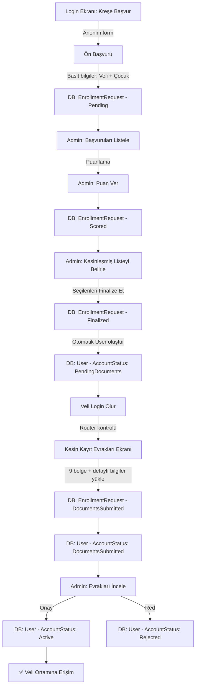

# Kreş Kayıt İş Akışı — Uygulama Planı

## Akış Diyagramı



## Veri Modeli Değişiklikleri

### 1. EnrollmentStatus Enum (Genişletilmiş)
```
Pending           = 0   (Ön başvuru yapıldı)
Scored            = 1   (Admin puanladı)
Finalized         = 2   (Kesinleşmiş listede — User hesabı oluşturuldu)
DocumentsSubmitted = 3  (Kesin kayıt evrakları yüklendi)
Approved          = 4   (Admin onayladı — tam erişim)
Rejected          = 5   (Reddedildi)
```

### 2. User.AccountStatus (Yeni Alan)
```
PendingDocuments    = 0  (Kesinleşmiş listede, evrak bekliyor)
DocumentsSubmitted  = 1  (Evraklar yüklendi, admin onayı bekliyor)  
Active              = 2  (Tam erişim)
Suspended           = 3  (Askıya alındı)
```

### 3. EnrollmentRequest — Ek Alanlar
- `Score` (int?) — Admin puanı
- `ScoringNotes` (string?) — Puanlama notları

## API Endpoint'leri

| Endpoint | Yetki | Açıklama |
|---|---|---|
| `POST /api/enrollment` | Anonim | Ön başvuru (basit) |
| `GET /api/enrollment/pending` | Admin | Bekleyen başvurular |
| `PUT /api/enrollment/{id}/score` | Admin | Puanlama |
| `PUT /api/enrollment/{id}/finalize` | Admin | Kesinleştir + User oluştur |
| `GET /api/enrollment/finalized` | Admin | Kesinleşmiş liste |
| `POST /api/final-registration/documents/{field}` | Auth (Veli) | Evrak yükle |
| `PUT /api/final-registration/submit` | Auth (Veli) | Evrakları tamamla |
| `PUT /api/enrollment/{id}/approve-docs` | Admin | Evrak onayı → tam erişim |

## Flutter Ekranları

| Ekran | Koşul | İçerik |
|---|---|---|
| Login → "Kreşe Başvur" | Anonim | Basit form (veli + çocuk genel bilgi) |
| Kesin Kayıt Evrakları | `AccountStatus == PendingDocuments` | 9 belge yükleme + detaylı bilgiler |
| "Evraklarınız İnceleniyor" | `AccountStatus == DocumentsSubmitted` | Bekle ekranı |
| Normal Uygulama | `AccountStatus == Active` | Tam erişim |
